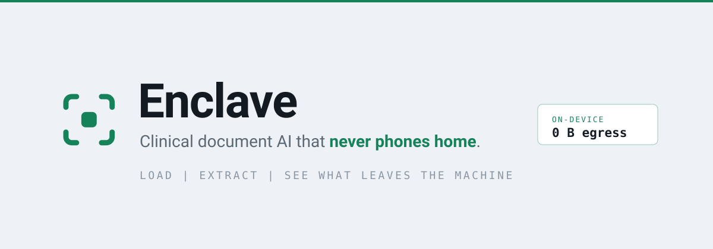

<picture>
  <source media="(prefers-color-scheme: dark)"  srcset="assets/banner-dark.svg">
  <source media="(prefers-color-scheme: light)" srcset="assets/banner-light.svg">
  
</picture>

[](https://github.com/Builder106/enclave/actions/workflows/ci.yml)
[](https://nodejs.org/)
[](https://start.solidjs.com/)
[](https://ai-sdk.dev/)
[](https://enclave-iota.vercel.app)
[](#the-providers)
[](#license)

> **Private AI for medical records.** Enclave extracts diagnoses and billing codes directly on your computer without sending patient data to the cloud.

## 💡 What is Enclave?

Processing sensitive medical paperwork with cloud AI risks exposing private patient records. Enclave runs lightweight AI models directly on the hospital's local computer. It accurately extracts diagnoses and insurance codes while tracking data flow to guarantee no patient information leaves the building.

Enclave provides an interactive workbench for clinical document extraction. Load a synthetic medical bill, choose an extractor (a deterministic rules parser, an on-device local model, or a hosted cloud model), and run it. The source document displays on the left while structured medical records populate on the right, measured with a live gauge proving whether bytes stayed on-device (0 B) or crossed to the cloud.

**▶ Live Demo:** [enclave-iota.vercel.app](https://enclave-iota.vercel.app) (pick a specimen, pick an extractor, and hit Run).

## The workbench

<details open>
<summary><b>Walkthrough: Run a specimen in the cloud, then keep it on-device</b></summary>


Pick a specimen, choose **Groq**, and watch ~2 KB travel device→cloud as the fields populate; switch to **Local** and the same extraction runs sealed at **0 B**. ([mp4](assets/demo-workbench.mp4)) — recorded by the Gherkin demo suite (`pnpm demo && pnpm demo:gif`).

</details>

## The headline findings

Every number below is a real measured run over 50 held-out synthetic medical bills (`seed 1`), played back by the workbench, rather than a live demo of one lucky document.

### Rules baseline (deterministic parser, no AI model)

> **96.0% parse rate, 95.0% field accuracy, 84.0% exact match, code accuracy 98.3%, anomaly detection 90.0% at instant speed, $0 cost, and 0 bytes sent to the cloud.** The baseline without AI is deliberately high: a straightforward rules parser over noisy scanned text sets the bar an AI model has to beat before its slower speed and extra cost are worth paying.

### Local (on-device AI via Ollama, qwen2.5:3b-instruct)

> **100% parse rate, 96.3% field accuracy, 36.0% exact match, code accuracy 81.0%, anomaly detection 61.5% at 23.6 seconds per document on an 8 GB Apple M1 Mac, $0 cost, and 0 bytes sent to the cloud.** The local model never fails to structure a document and beats the non-AI baseline on individual fields. However, it trails on exact overall matches because misreading one charge can trigger a false billing alarm. The key takeaway is that the local model offers strong privacy and resistance to messy text, but requires careful verification.

### Cloud AI (openai/gpt-oss-120b via Groq)

> **100% parse rate, 98.3% field accuracy, 78.0% exact match, code accuracy 99.6%, anomaly detection 95.2% at $0.0008 per document, with 97,303 bytes sent to the cloud.** A large cloud AI model easily outperforms smaller models across almost every metric. But to get that accuracy, **97 KB of patient medical data had to leave the machine and travel to the cloud.** That is the fundamental tradeoff: larger cloud models buy accuracy, but the cost is paid in patient privacy as well as dollars.

**AWS Bedrock (Claude Haiku 4.5) (pending evaluation):** Automated evaluation is running to measure cloud performance against on-device extraction across all 50 benchmark documents.

**Note on testing data:** The benchmark generator draws medical procedure descriptions from the same code dataset searched by the matcher. Treat these numbers as a standardized benchmark comparison rather than a claim about raw unformatted hospital notes. Full details are in [docs/BRIEF.md](docs/BRIEF.md).

## How it works

```mermaid
sequenceDiagram
    autonumber
    actor User
    participant WB as Workbench (browser)
    participant Data as data/demo | measured results
    User->>WB: pick a specimen + an extractor (rules / local / groq)
    User->>WB: Run extraction
    WB->>Data: load the measured result for (document, provider)
    WB-->>User: reveal structured fields, each ✓/✗ vs ground truth
    WB-->>User: transmission gauge: 0 B on-device (green) or bytes to cloud (amber)
    Note over WB,Data: results are REAL measured runs, produced offline by the<br/>rules/local/groq pipeline; the workbench plays them back
```

Behind the browser, the measurement pipeline does the real work: `runDocument` sends the noisy text to one provider for the perception step (converting text into structured fields), and then reliable TypeScript code performs code matching and anomaly detection. (A lesson carried from [Helm](https://github.com/Builder106/helm), where an LLM that read invoices at 91.9% dropped to 54% on multi-step arithmetic math.) Every run records its data egress byte count; `scripts/export-demo.ts` joins those results with the source documents into what the workbench displays.

## The providers

| Provider | What it is | Marginal cost | Where document bytes go |
| --- | --- | --- | --- |
| `rules` | Deterministic parser without AI (baseline) | $0 | Nowhere. Stays completely in-process. |
| `local` | Open-source on-device model via Ollama (`qwen2.5:3b-instruct`) | $0 | `localhost`. Never leaves the machine. |
| `groq` | Cloud AI model (`openai/gpt-oss-120b`) | $0 on free tier (metered list price) | Groq servers. Counted byte-for-byte as `egressBytes`. |
| `bedrock` | Claude on AWS Bedrock (frontier cloud AI) | per-token metered | AWS servers. Counted byte-for-byte as `egressBytes`. |

Same pipeline, same test cases, same metrics: the provider is a one-line swap through the AI SDK. The question the workbench helps answer: *is a lightweight 3B model running on your local computer good enough to skip sending patient data to the cloud?*

## Built end-to-end with Claude Code

Every part of the system (domain schemas, synthetic document generator, three-provider pipeline, evaluation harness, interactive workbench, and tests) was constructed with Claude Code. The engine is thoroughly covered by automated unit tests. Decisions and milestones are logged in [JOURNAL.md](JOURNAL.md).

## Quickstart

```bash
pnpm install
cp .env.example .env

pnpm generate --seed 1                  # 60 synthetic superbills (50 eval / 10 dev)
pnpm measure --provider rules --seed 1  # the no-ML baseline — runs anywhere, $0
tsx scripts/export-demo.ts              # join docs + results → data/demo/seed-1.json
pnpm dev                                # the workbench at localhost:3000
pnpm test                               # vitest suite (engine)
```

For the local path: install [Ollama](https://ollama.com), `ollama pull qwen2.5:3b-instruct`, then `pnpm measure --provider local`. For Groq, set `GROQ_API_KEY` in `.env` (free tier covers the evaluation volume). Each hosted credential is only touched by its own provider.

## Project structure

```text
src/lib/contract.ts    Domain types, validation schemas, metrics, and defaults
src/lib/codes/         Medical billing code datasets (ICD-10-CM and CPT)
src/generators/        Synthetic medical bill generator with OCR noise simulation
src/agent/             Rules parser, LLM extraction, code matching, and anomaly checks
src/eval/              Accuracy metrics and benchmark scoring
scripts/               CLI scripts (generate, measure, export demo data)
src/db/                Database schemas and local audit log
src/app/ + src/components/workbench.tsx   Interactive workbench interface
data/demo/             Measured benchmark results played back in the browser
```

## Background and portfolio context

Enclave is the privacy-focused sequel to [MedCore](https://github.com/Builder106/med-core) (winner of the 2026 Yale Africa Innovation Symposium), which showed that community clinics in low-connectivity settings need offline-first records. Enclave extends this to AI: if medical records cannot depend on reliable internet, the AI models reading them should not either.

## Roadmap

- **AWS Bedrock evaluation**: Complete full automated runs across all 50 test documents for the frontier cloud benchmark.
- **Side-by-side comparison mode**: Compare results from all three extractors simultaneously to highlight the privacy versus accuracy trade-off.
- **Model fine-tuning**: Fine-tune the local 3B model on medical documents to narrow the accuracy gap with large cloud models.

## License

MIT (see [LICENSE](LICENSE)).
